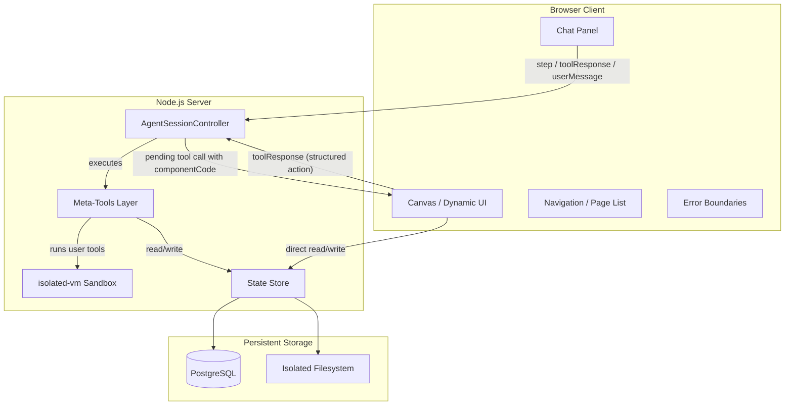

# Self-Modifying Personal Agent

## Architecture Overview




## Files to Copy from Monorepo

These files form the foundation. Adapt imports as needed for the new repo.

- `AgentSessionController.ts` — generic agent loop, session management, message compaction, step/cancel/feedback endpoints
- `scriptExecutorIsolated.ts` — isolated-vm sandbox with injectable globals/functions, fetch, parseCSV, btoa/atob, setTimeout
- `safeFetch.ts` — SSRF-protected fetch (keep even for personal use; prevents accidental localhost calls from agent-written tools)

Use `IntegratorAgentImplementation.ts` as a reference for implementing the `AgentImplementation` interface, but do not copy it directly.

## Database Schema

A single PostgreSQL database with these tables:

### `agent_sessions` (already exists in copied code)

Stores conversation history, status, pending tool calls, token usage. No changes needed.

### `agent_config` (new)

Single-row table holding the agent's mutable identity.


| Column          | Type        | Description                                                   |
| --------------- | ----------- | ------------------------------------------------------------- |
| `_id`           | text        | Always `'default'`                                            |
| `system_prompt` | text        | The agent's current system prompt                             |
| `learned_notes` | text        | Append-only section of notes the agent has written for itself |
| `version`       | integer     | Auto-incremented on every edit (for rollback)                 |
| `modified_on`   | timestamptz | Last modification time                                        |


### `agent_tools` (new)

Each row is a tool the agent has created.


| Column             | Type        | Description                                            |
| ------------------ | ----------- | ------------------------------------------------------ |
| `_id`              | text        | Tool name (unique, snake_case)                         |
| `description`      | text        | Human-readable description (shown to LLM in tool list) |
| `parameter_schema` | jsonb       | JSON Schema for the tool's parameters                  |
| `code`             | text        | JavaScript code executed in isolated-vm                |
| `version`          | integer     | Auto-incremented on update                             |
| `enabled`          | boolean     | Whether this tool appears in the active tool set       |
| `created_on`       | timestamptz |                                                        |
| `modified_on`      | timestamptz |                                                        |


### `agent_ui_components` (new)

Reusable UI components / "pages" the agent has created.


| Column         | Type        | Description                                          |
| -------------- | ----------- | ---------------------------------------------------- |
| `_id`          | text        | Component name (unique)                              |
| `description`  | text        | What this component does                             |
| `code`         | text        | React/JSX component code (string)                    |
| `props_schema` | jsonb       | Expected props (optional, for agent's own reference) |
| `version`      | integer     |                                                      |
| `created_on`   | timestamptz |                                                      |
| `modified_on`  | timestamptz |                                                      |


### `agent_state` (new)

Key-value store for persistent agent state.


| Column        | Type        | Description             |
| ------------- | ----------- | ----------------------- |
| `key`         | text        | State key (primary key) |
| `value`       | jsonb       | Arbitrary JSON value    |
| `modified_on` | timestamptz |                         |


### `agent_config_history` (new)

Audit log for prompt/notes changes (for rollback).


| Column          | Type        | Description                                      |
| --------------- | ----------- | ------------------------------------------------ |
| `_id`           | serial      |                                                  |
| `version`       | integer     | Matches `agent_config.version` at time of change |
| `system_prompt` | text        | Snapshot                                         |
| `learned_notes` | text        | Snapshot                                         |
| `created_on`    | timestamptz |                                                  |


## Server-Side: AgentImplementation

Create `PersonalAgentImplementation` implementing the `AgentImplementation` interface from `AgentSessionController.ts`.

### System Prompt Construction

On each session init and (if compaction is on) at compaction time, dynamically build the system prompt from:

1. The current `agent_config.system_prompt`
2. The current `agent_config.learned_notes`
3. A summary of available tools (name + description for each enabled tool in `agent_tools`)
4. A summary of available UI components (name + description from `agent_ui_components`)

This keeps the agent aware of its full capability set without loading all tool code into context.

### Meta-Tools (always available, hardcoded)

These are the privileged tools the agent always has. They are **not** stored in `agent_tools` — they are part of the implementation.


| Tool                                           | Description                                                                                                       |
| ---------------------------------------------- | ----------------------------------------------------------------------------------------------------------------- |
| `read_system_prompt`                           | Read the current stored system prompt (ground truth, may differ from in-context version after mid-conversation edits). |
| `edit_system_prompt`                           | Edit the system prompt with granular operations: replace, find_replace, append, prepend, delete. Saves previous version to history. |
| `read_learned_notes`                           | Read the current learned notes.                                                                                   |
| `edit_learned_notes`                           | Edit learned notes with the same operations as edit_system_prompt.                                                |
| `get_state` / `set_state` / `delete_state`     | Read/write/delete keys in `agent_state`.                                                                          |
| `list_state_keys`                              | List all keys (with optional prefix filter).                                                                      |
| `db_sql` / `db_schema`                         | Agent's own SQLite database (`agent_data.db`) for structured data storage and SQL queries. Separate from the app DB. |
| `create_tool`                                  | Create a new tool (name, description, parameter schema, code).                                                    |
| `update_tool`                                  | Update an existing tool's code, description, or schema.                                                           |
| `delete_tool` / `enable_tool` / `disable_tool` | Manage tool lifecycle.                                                                                            |
| `list_tools`                                   | List all tools with descriptions and enabled status.                                                              |
| `read_tool`                                    | Read a tool's full definition including code.                                                                     |
| `run_sandbox_code`                             | Execute ad-hoc JavaScript in isolated-vm (for exploration).                                                       |
| `create_ui_component`                          | Create a named React component.                                                                                   |
| `update_ui_component`                          | Update an existing component.                                                                                     |
| `delete_ui_component`                          | Delete a component.                                                                                               |
| `list_ui_components`                           | List available UI components.                                                                                     |
| `render_and_wait`                              | Render a UI component (by name or inline code) and pause for user interaction. Returns `asPendingToolCall: true`. |
| `render_blocks`                                | Render structured UI blocks (table, chart, form, markdown, etc.) and pause. Returns `asPendingToolCall: true`.    |
| `send_message`                                 | Send a text message to the user (no pause).                                                                       |
| `fetch_url`                                    | Fetch a URL with SSRF protection (uses `safeFetch`).                                                              |
| `ask_user`                                     | Ask the user a question in chat. Returns `asPendingToolCall: true`.                                               |
| `browser_*`                                    | Browser tools (navigate, screenshot, click, type, extract_text, extract_html, evaluate, close) via headless Playwright. |


### Dynamic Tool Execution

When the LLM calls a tool name that matches a row in `agent_tools`, the implementation:

1. Loads the tool's `code` and `parameter_schema` from the database
2. Validates the args against the schema
3. Calls `executeScript(code, { globals: { args, state } })` where:
  - `args` is the validated tool arguments
  - `state` is a helper object with `get(key)`, `set(key, value)`, etc. injected via `globalFunctions`
4. Returns the script's result as the tool result to the LLM

The tool set passed to `getTools()` must be built dynamically each step: merge the hardcoded meta-tools with tool definitions loaded from `agent_tools`.

### Tool Context for User Tools

Each user-created tool running in isolated-vm gets access to:

- `args` — the validated arguments from the LLM
- `fetch(url, options)` — already provided by `scriptExecutorIsolated.ts`
- `state.get(key)` / `state.set(key, value)` — injected via `globalFunctions`, reads/writes `agent_state`
- `console.log/warn/error` — already provided
- `secrets` — a key-value object of stored secrets (API keys, tokens)

## Client-Side Architecture

### Application Shell (fixed, not agent-modifiable)

```
+------------------------------------------+
|  Nav: [Chat] [Page1] [Page2] ... [Gear]  |
+------------------------------------------+
|                                          |
|   Active Panel                           |
|   (Chat or rendered component/page)      |
|                                          |
+------------------------------------------+
```

Built with React + Bootstrap 5. The shell provides:

- **Chat panel**: standard message list + input box, always available
- **Page tabs**: one tab per `agent_ui_components` entry (agent can create/delete these)
- **Canvas area**: where dynamic components render
- **Settings**: view/edit system prompt, manage tools, view state, view history

### Dynamic Component Rendering

No iframe. Components run directly in the React tree.

```typescript
import { transform } from "sucrase"

function renderAgentComponent(
  code: string,
  deps: Record<string, any>
): React.ComponentType<any> {
  const js = transform(code, {
    transforms: ["jsx", "typescript"],
    jsxRuntime: "classic",
  }).code

  const argNames = Object.keys(deps)
  const argValues = Object.values(deps)
  const factory = new Function(...argNames, `${js}\nreturn __default;`)
  return factory(...argValues)
}
```

Wrap every dynamic component in a React error boundary that shows the error + source code on failure.

### Dependency Injection for Agent Components

All agent-authored components receive these as dependencies (passed to `renderAgentComponent`):

```typescript
const deps = {
  // React
  React, useState, useEffect, useCallback, useMemo, useRef,

  // UI primitives (pre-built, stable)
  Card, Table, Button, Alert, Badge, Tabs, Form, TextInput,
  Select, DatePicker, Toggle, Spinner, CodeBlock, Chart,
  Stack, Grid,

  // Agent communication
  useAgentState,    // (key) => [value, setValue] — direct state read/write, no LLM
  callTool,         // (action, payload) => void — sends toolResponse, wakes LLM
  sendMessage,      // (text) => void — sends userMessage, wakes LLM
}
```

### Three Communication Channels

As discussed, the client has three ways to communicate:

1. `**useAgentState(key)**` — reads/writes `agent_state` directly via a REST endpoint. No LLM involved. Good for local UI state, preferences, counters.
2. `**callTool(action, payload)**` — sends a `toolResponse` to the pending `render_and_wait` tool call. Resumes the LLM with `{ action, payload }` as the result.
3. `**sendMessage(text)**` — sends a `userMessage` on the step endpoint. Equivalent to the user typing in the chat box.

### Structured Blocks (for quick UI without full components)

The `render_blocks` tool accepts JSON and the client renders it using pre-built components:

```typescript
type UIBlock =
  | { type: "markdown"; content: string }
  | { type: "table"; columns: { key: string; label: string }[]; data: any[] }
  | { type: "chart"; chartType: "line" | "bar" | "pie"; data: any }
  | { type: "form"; fields: FormField[]; submitLabel: string }
  | { type: "code"; language: string; content: string }
  | { type: "image"; url: string; alt?: string }
  | { type: "alert"; variant: "info" | "warning" | "danger" | "success"; content: string }
  | { type: "json"; data: any }
```

This is the 80% path. The agent uses blocks for quick data display, forms, and status updates. Full component rendering is the escape hatch for complex UIs.

## Build Order

### Phase 1: Server foundation

- Set up the new repo: pnpm, TypeScript, Express, PostgreSQL
- Copy over `AgentSessionController.ts`, `scriptExecutorIsolated.ts`, `safeFetch.ts`
- Create database schema (all tables above)
- Implement `PersonalAgentImplementation` with just the meta-tools (no dynamic tools yet)
- Write a hardcoded initial system prompt
- Verify the agent loop works end-to-end via curl / REST calls

### Phase 2: Self-modification

- Implement `create_tool` / `update_tool` / `delete_tool` meta-tools
- Implement dynamic tool loading: on each step, query `agent_tools` and merge with meta-tools
- Implement `edit_system_prompt` / `edit_learned_notes` with versioning
- Implement `get_state` / `set_state` for persistent memory
- Test: ask the agent to create a tool, then use it in a follow-up message

### Phase 3: Chat UI

- Set up React app (Vite + React + Bootstrap 5)
- Build the chat panel: message list, input box, step polling
- Handle `waiting_for_input` status: render pending tool call UIs (ask_user, etc.)
- Build settings panel: view prompt, list tools, browse state

### Phase 4: Dynamic UI rendering

- Add sucrase to the client bundle
- Build `renderAgentComponent` and the error boundary wrapper
- Build the pre-built UI component library (Card, Table, Button, Form, etc.)
- Implement `useAgentState` hook (REST calls to `agent_state` endpoints)
- Implement `callTool` and `sendMessage` client functions
- Implement `render_and_wait` and `render_blocks` meta-tools
- Build the page/tab navigation system from `agent_ui_components`

### Phase 5: Polish and bootstrap

- Write the initial system prompt (explain the agent's capabilities, available meta-tools, how tool creation works, how UI rendering works)
- Seed 3-5 starter tools (e.g., a web search tool, a note-taking tool, a reminder tool)
- Add WebSocket or SSE for real-time state change notifications to the client
- Add browser access (headless Chrome via Playwright, exposed as a set of tools)

## Key Design Decisions

- **No iframe sandbox for UI**: since this is personal-use, agent components run directly in the React tree. Only protection is React error boundaries.
- **Tools are code strings, not modules**: each tool is a JS string stored in the DB, executed in isolated-vm. No build step, no imports. Dependencies are injected as globals.
- **System prompt is append-friendly**: split into immutable core prompt + mutable `learned_notes`. The agent should prefer appending notes over rewriting the core prompt.
- **All state is in PostgreSQL**: sessions, config, tools, UI components, key-value state. Single source of truth, easy to back up and inspect.
- **Dynamic tool set per step**: `getTools()` queries the database each time. This means tool creation takes effect immediately on the next LLM call.
