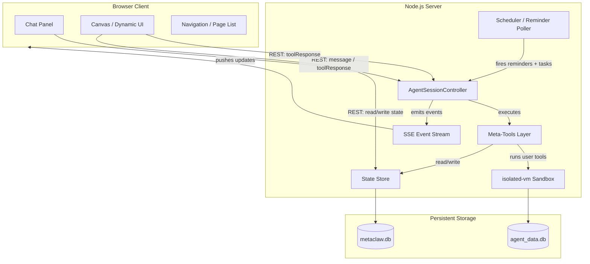

# Server Design

Node.js + TypeScript + Express. SQLite via better-sqlite3 for persistence. See [Technology Choices](./Technology%20Choices.md) for full stack details.

## Architecture

Two SQLite databases:
- **`metaclaw.db`** — app-internal: sessions, config, tools, libraries, components, state, reminders, scheduled tasks, secrets, config history
- **`agent_data.db`** — agent-controlled: tables the agent creates via `db_sql`. Completely separate so the agent can never touch app internals.

## Files to Copy from Monorepo

These files form the foundation. Adapt imports as needed.

- `AgentSessionController.ts` — generic agent loop, session management, message compaction, step/cancel/feedback endpoints
- `scriptExecutorIsolated.ts` — isolated-vm sandbox with injectable globals/functions, fetch, parseCSV, btoa/atob, setTimeout
- `safeFetch.ts` — SSRF-protected fetch (blocks private IPs, localhost, metadata endpoints)

Use `IntegratorAgentImplementation.ts` as a reference for the `AgentImplementation` interface, but don't copy it directly.

## Database Schema (`metaclaw.db`)

All types are SQLite-native. JSON is stored as `text` and parsed in application code.

### `agent_sessions` (from copied code, extended)

Stores conversation history, status, pending tool calls. Extended with sub-session and token limit support.

| Column | Type | Description |
|--------|------|-------------|
| `parent_session_id` | text | FK to parent session (null for top-level sessions) |
| `parent_tool_call_id` | text | The `wait_for_sessions` tool call ID this sub-session reports to |
| `model` | text | Model used for this session (may differ from parent for cheaper sub-sessions) |
| `token_limit` | integer | Max tokens before the session is stopped (null = system default) |
| `token_usage` | integer | Tokens consumed so far |
| `notepad` | text | Session-scoped freeform markdown scratchpad (see [Session Notepad](./Session%20Notepad.md)) |

### `agent_config`

Single-row table holding the agent's mutable identity.

| Column | Type | Description |
|--------|------|-------------|
| `_id` | text | Always `'default'` |
| `system_prompt` | text | The agent's system prompt — core instructions plus agent-appended observations |
| `version` | integer | Auto-incremented on every edit (for rollback) |
| `modified_on` | text | ISO 8601 timestamp |

### `agent_tools`

Each row is a tool the agent has created.

| Column | Type | Description |
|--------|------|-------------|
| `_id` | text | Tool name (unique, snake_case) |
| `description` | text | Human-readable description (shown to LLM in tool list) |
| `parameter_schema` | text | JSON Schema for the tool's parameters (stored as JSON string) |
| `code` | text | JavaScript code executed in isolated-vm |
| `version` | integer | Auto-incremented on update |
| `enabled` | integer | 1/0 — whether this tool appears in the active tool set |
| `created_on` | text | ISO 8601 |
| `modified_on` | text | ISO 8601 |

### `agent_libraries`

Shared code modules loadable via `require('name')` in the sandbox.

| Column | Type | Description |
|--------|------|-------------|
| `_id` | text | Library name (unique, snake_case) |
| `description` | text | What this library provides |
| `code` | text | CommonJS module code (`exports.foo = ...` or `module.exports = ...`) |
| `version` | integer | Auto-incremented on update |
| `created_on` | text | ISO 8601 |
| `modified_on` | text | ISO 8601 |

### `agent_ui_components`

Reusable React components / "pages" the agent has created.

| Column | Type | Description |
|--------|------|-------------|
| `_id` | text | Component name (unique) |
| `description` | text | What this component does |
| `code` | text | React/JSX component code |
| `props_schema` | text | Optional JSON Schema describing expected props |
| `version` | integer | |
| `created_on` | text | ISO 8601 |
| `modified_on` | text | ISO 8601 |

### `agent_state`

Key-value store for persistent agent state.

| Column | Type | Description |
|--------|------|-------------|
| `key` | text | State key (primary key) |
| `value` | text | Arbitrary JSON value |
| `modified_on` | text | ISO 8601 |

### `agent_secrets`

User-managed API keys and tokens. Read-only from the agent's perspective (exposed as `secrets` in the sandbox). Managed by the user through the settings UI.

| Column | Type | Description |
|--------|------|-------------|
| `_id` | text | Secret key name (e.g. `OPENWEATHER_API_KEY`) |
| `value` | text | The secret value (stored plaintext — single-user, local app) |
| `created_on` | text | ISO 8601 |
| `modified_on` | text | ISO 8601 |

### `agent_reminders`

Session-scoped one-shot reminders. The server polls this table and injects the reminder's message into the originating session when due.

| Column | Type | Description |
|--------|------|-------------|
| `_id` | text | Unique reminder ID (generated) |
| `session_id` | text | FK to `agent_sessions` — the session to wake |
| `message` | text | Message injected into the session when the reminder fires |
| `at` | text | ISO 8601 timestamp — when to fire |
| `created_on` | text | ISO 8601 |

### `agent_scheduled_tasks`

System-level automated jobs. Not tied to any session. Each firing creates a fresh session with the task's prompt. The server polls this table on an interval (~30s).

| Column | Type | Description |
|--------|------|-------------|
| `_id` | text | Unique task ID (generated) |
| `name` | text | Human-readable label |
| `task` | text | Task prompt — becomes the initial user message in each fresh session |
| `type` | text | `once` or `cron` |
| `at` | text | For `once`: ISO 8601 timestamp |
| `cron` | text | For `cron`: cron expression (e.g. `0 9 * * MON`) |
| `model` | text | Model to use for each firing (null = system default) |
| `token_limit` | integer | Max tokens per firing (null = system default) |
| `enabled` | integer | 1/0 |
| `next_run` | text | Pre-computed next fire time (ISO 8601, for efficient polling) |
| `last_run` | text | When it last fired (null if never) |
| `created_on` | text | ISO 8601 |

### `agent_skills`

Named markdown documents the agent can reference. See [Skills](./Skills.md).

| Column | Type | Description |
|--------|------|-------------|
| `_id` | text | Unique slug (e.g. `quarterly-excel-reports`) |
| `title` | text | Human-readable title |
| `description` | text | Brief description (shown in system prompt summary for discovery) |
| `content` | text | Full markdown content |
| `tags` | text | JSON array of tags for categorization |
| `source` | text | `user` or `agent` |
| `version` | integer | Auto-incremented on update |
| `enabled` | integer | 1/0 |
| `created_on` | text | ISO 8601 |
| `modified_on` | text | ISO 8601 |

### `agent_files`

File workspace metadata. Actual file data lives on disk in `files/`. See [Files](./Files.md).

| Column | Type | Description |
|--------|------|-------------|
| `_id` | text | UUID |
| `name` | text | Filename |
| `mime_type` | text | Detected MIME type (via magic bytes) |
| `size` | integer | Size in bytes |
| `disk_path` | text | Path within `files/` directory |
| `source` | text | `upload` (from user), `created` (by agent), `derived` (generated from another file) |
| `source_session_id` | text | Which session uploaded or created the file |
| `created_on` | text | ISO 8601 |
| `modified_on` | text | ISO 8601 |

### `agent_config_history`

Audit log for prompt/notes changes (for rollback).

| Column | Type | Description |
|--------|------|-------------|
| `_id` | integer | Auto-increment primary key |
| `version` | integer | Matches `agent_config.version` at time of change |
| `system_prompt` | text | Snapshot |
| `created_on` | text | ISO 8601 |

## AgentImplementation

Create `PersonalAgentImplementation` implementing the `AgentImplementation` interface from `AgentSessionController.ts`.

### System prompt construction

On each session init and at compaction time, dynamically build the system prompt from:

1. The current `agent_config.system_prompt` (includes core instructions and agent-appended observations)
2. The current date/time (so the agent can compute timestamps for reminders and scheduling)
3. A summary of available tools (name + description for each enabled tool in `agent_tools`)
4. A summary of available libraries (name + description from `agent_libraries`)
5. A summary of available UI components (name + description from `agent_ui_components`)
6. Available secret key names from `agent_secrets` (names only, not values — so the agent knows which API keys exist when creating tools)
7. A summary of available skills (name + title + description + tags from `agent_skills` — see [Skills](./Skills.md))
8. The session notepad content (from `agent_sessions.notepad` — see [Session Notepad](./Session%20Notepad.md))

This keeps the agent aware of its full capability set without loading all tool/library code into context.

### Dynamic tool execution

When the LLM calls a tool name that matches a row in `agent_tools`, the implementation:

1. Loads the tool's `code` and `parameter_schema` from the database
2. Validates the args against the schema
3. Executes the code in isolated-vm with the full sandbox runtime injected (see [Sandbox Runtime](./Sandbox%20Runtime.md))
4. Returns the script's result as the tool result to the LLM

The tool set passed to `getTools()` is built dynamically each step: merge the hardcoded meta-tools with tool definitions loaded from `agent_tools`. Agent-created tools store raw JSON Schema in the DB and are passed to the Vercel AI SDK via `jsonSchema()`.

### Scheduler

A single `setInterval` loop (~30s) that:

1. Queries `agent_reminders` for rows where `at <= now()`. For each: injects the message into the target session, kicks off an agent step, then deletes the reminder row.
2. Queries `agent_scheduled_tasks` for rows where `next_run <= now() AND enabled = 1`. For each: creates a fresh session with the task prompt (using the task's model and token_limit), kicks off an agent step, updates `last_run`, and recomputes `next_run` (or deletes the row if `type = 'once'`).

### Event emission

All state-changing operations emit events via an in-process `EventEmitter`. The SSE handler subscribes and pushes them to connected browser tabs. See [Frontend Design — Real-Time Sync](./Frontend%20Design.md#real-time-sync-sse--rest) for event types.

Emitters:
- Agent loop → `session:message`, `session:status`, `session:stream`, `session:tool_call`, `session:pending_input`
- Sub-sessions → `session:spawned`, `session:completed`
- State store → `state:change`
- Component/tool/library/skill CRUD → `component:change`
- File operations → `file:created`, `file:modified`, `file:deleted` (see [Files](./Files.md))
- Session creation/deletion → `sessions:list`
- Scheduler → `session:status` (when a reminder/task fires)

## Key Design Decisions

- **Two SQLite databases**: app internals (`metaclaw.db`) and agent data (`agent_data.db`) are completely separate. The agent can never read or modify its own session history, tools table, or config — only through the meta-tools.
- **Dynamic tool set per step**: `getTools()` queries the database each time. Tool creation takes effect immediately on the next LLM call.
- **Single system prompt**: the agent's identity is one document — core instructions at the top, agent-appended observations at the bottom. For structured knowledge, the agent creates skills. Config history provides rollback.
- **Libraries enable code reuse**: tools are thin wrappers; shared logic lives in libraries loaded via `require()`. See [Sandbox Runtime](./Sandbox%20Runtime.md).
- **Reminders vs scheduled tasks**: reminders are session-scoped and one-shot (wake an existing session). Scheduled tasks are system-level (create fresh sessions each firing). See [Built-in Tools](./Built-in%20Tools.md#reminders) for details.
- **Files on disk, metadata in SQLite**: files are stored in `files/` on disk (can be 10–50 MB) with metadata in `agent_files`. Format-specific operations (spreadsheet, PDF, image) run server-side via ExcelJS, pdf-lib, sharp — the sandbox gets proxy stubs. See [Files](./Files.md).
- **Skills for structured knowledge**: discrete markdown documents with name + description for selective loading. The agent appends quick facts to its system prompt; procedures and domain knowledge become skills. See [Skills](./Skills.md).
- **Session notepad survives compaction**: per-session freeform scratchpad stored on the session row, included in the system prompt every turn. Pre-compaction warning gives the agent a chance to save working state. See [Session Notepad](./Session%20Notepad.md).
- **No iframe sandbox for UI**: personal-use app — agent components run directly in the React tree. Error boundaries are the only safety net.
