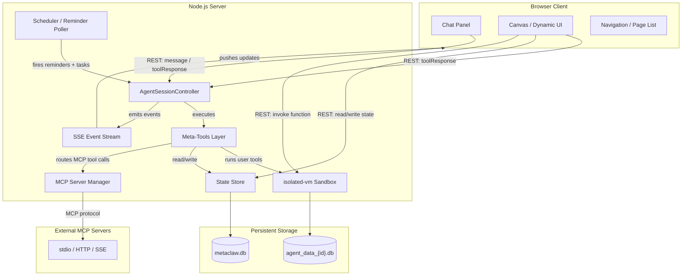

# Server Design

Node.js + TypeScript + Express. SQLite via better-sqlite3 for persistence. See [Technology Choices](./Technology%20Choices.md) for full stack details.

## Architecture

```mermaid
graph TD
    subgraph client [Browser Client]
        ChatPanel[Chat Panel]
        CanvasPanel[Canvas / Dynamic UI]
        NavBar[Navigation / Page List]
    end

    subgraph server [Node.js Server]
        AgentLoop[AgentSessionController]
        MetaTools[Meta-Tools Layer]
        IsolatedVM[isolated-vm Sandbox]
        StateStore[State Store]
        Scheduler[Scheduler / Reminder Poller]
        MCPManager[MCP Server Manager]
        SSE[SSE Event Stream]
    end

    subgraph storage [Persistent Storage]
        AppDB[(metaclaw.db)]
        AgentDB[("agent_data_{id}.db")]
    end

    subgraph external [External MCP Servers]
        MCPServers["stdio / HTTP / SSE"]
    end

    ChatPanel -->|"REST: message / toolResponse"| AgentLoop
    CanvasPanel -->|"REST: toolResponse"| AgentLoop
    CanvasPanel -->|"REST: read/write state"| StateStore
    CanvasPanel -->|"REST: invoke function"| IsolatedVM
    AgentLoop -->|"executes"| MetaTools
    MetaTools -->|"runs user tools"| IsolatedVM
    MetaTools -->|"read/write"| StateStore
    MetaTools -->|"routes MCP tool calls"| MCPManager
    MCPManager -->|"MCP protocol"| MCPServers
    StateStore --> AppDB
    IsolatedVM --> AgentDB
    Scheduler -->|"fires reminders + tasks"| AgentLoop
    AgentLoop -->|"emits events"| SSE
    SSE -->|"pushes updates"| client
```

The database supports multiple agents. Each agent has its own system prompt, tools, functions, libraries, skills, UI components, state, sessions, MCP server connections, and scheduled tasks. A fresh install creates a single `default` agent.

Two kinds of SQLite databases:
- **`metaclaw.db`** — app-internal: agents, projects, sessions, tools, functions, libraries, components, state, reminders, scheduled tasks, secrets, config history, MCP server configs, skills, files metadata
- **`agent_data_{id}.db`** (one per agent) — agent-controlled: tables the agent creates via `db_sql`. Completely separate so the agent can never touch app internals. Each agent gets its own database file.

## Files to Copy from Monorepo

These files form the foundation. Adapt imports as needed.

- `AgentSessionController.ts` — generic agent loop, session management, message compaction, step/cancel/feedback endpoints
- `scriptExecutorIsolated.ts` — isolated-vm sandbox with injectable globals/functions, fetch, parseCSV, btoa/atob, setTimeout
- `safeFetch.ts` — SSRF-protected fetch (blocks private IPs, localhost, metadata endpoints)

Use `IntegratorAgentImplementation.ts` as a reference for the `AgentImplementation` interface, but don't copy it directly.

## Database Schema (`metaclaw.db`)

All types are SQLite-native. JSON is stored as `text` and parsed in application code.

### `agent_sessions` (from copied code, extended)

Stores conversation history, status, pending tool calls. Extended with sub-session, forking, and token limit support. Scoped per agent.

| Column | Type | Description |
|--------|------|-------------|
| `agent_id` | text | FK to `agents` |
| `parent_session_id` | text | FK to parent session (null for top-level sessions) |
| `parent_tool_call_id` | text | The `wait_for_sessions` tool call ID this sub-session reports to |
| `forked_from_session_id` | text | If this session was created via `fork_session`, the session it was forked from (null for spawned/top-level sessions) |
| `model` | text | Model used for this session (may differ from parent for cheaper sub-sessions) |
| `token_limit` | integer | Max tokens before the session is stopped (null = system default) |
| `token_usage` | integer | Tokens consumed so far |
| `notepad` | text | Session-scoped freeform markdown scratchpad (see [Session Notepad](./Session%20Notepad.md)) |
| `project_id` | text | FK to `agent_projects`. Null for unscoped sessions. |

### `agents`

Each row defines an agent — its identity, system prompt, and default model. A fresh install creates one row with `_id = 'default'`.

| Column | Type | Description |
|--------|------|-------------|
| `_id` | text | Unique agent slug (e.g. `default`, `work`, `code-assistant`) |
| `name` | text | Human-readable display name |
| `system_prompt` | text | The agent's system prompt — core instructions plus agent-appended observations |
| `model` | text | Default model for this agent's sessions (null = system default) |
| `version` | integer | Auto-incremented on every config edit (for rollback) |
| `created_on` | text | ISO 8601 |
| `modified_on` | text | ISO 8601 |

### `agent_tools`

Each row is a tool the agent has created. Scoped per agent.

| Column | Type | Description |
|--------|------|-------------|
| `_id` | text | Tool name (unique per agent, snake_case) |
| `agent_id` | text | FK to `agents` |
| `description` | text | Human-readable description (shown to LLM in tool list) |
| `parameter_schema` | text | JSON Schema for the tool's parameters (stored as JSON string) |
| `code` | text | JavaScript code executed in isolated-vm |
| `version` | integer | Auto-incremented on update |
| `enabled` | integer | 1/0 — whether this tool appears in the active tool set |
| `created_on` | text | ISO 8601 |
| `modified_on` | text | ISO 8601 |

### `agent_functions`

Backend functions callable directly from UI components via `callBackend()`. Unlike tools (which are called by the LLM during sessions and return text for conversation context), functions are called by frontend code via HTTP and return structured JSON. They share the same sandbox runtime and agent-scoped resources (state, database, files, libraries) but run outside any session context. Scoped per agent.

| Column | Type | Description |
|--------|------|-------------|
| `_id` | text | Function name (unique per agent, snake_case) |
| `agent_id` | text | FK to `agents` |
| `description` | text | What this function does (for the LLM when authoring components, not at call time) |
| `parameter_schema` | text | JSON Schema for the function's input parameters (stored as JSON string) |
| `code` | text | JavaScript code executed in isolated-vm |
| `version` | integer | Auto-incremented on update |
| `enabled` | integer | 1/0 — whether this function is callable |
| `created_on` | text | ISO 8601 |
| `modified_on` | text | ISO 8601 |

### `agent_libraries`

Shared code modules loadable via `require('name')` in the sandbox. Scoped per agent.

| Column | Type | Description |
|--------|------|-------------|
| `_id` | text | Library name (unique per agent, snake_case) |
| `agent_id` | text | FK to `agents` |
| `description` | text | What this library provides |
| `code` | text | CommonJS module code (`exports.foo = ...` or `module.exports = ...`) |
| `version` | integer | Auto-incremented on update |
| `created_on` | text | ISO 8601 |
| `modified_on` | text | ISO 8601 |

### `agent_ui_components`

Reusable React components / "pages" the agent has created. Scoped per agent.

| Column | Type | Description |
|--------|------|-------------|
| `_id` | text | Component name (unique per agent) |
| `agent_id` | text | FK to `agents` |
| `description` | text | What this component does |
| `code` | text | React/JSX component code |
| `props_schema` | text | Optional JSON Schema describing expected props |
| `version` | integer | |
| `created_on` | text | ISO 8601 |
| `modified_on` | text | ISO 8601 |

### `agent_state`

Key-value store for persistent agent state. Scoped per agent, with optional project-level partitioning. State is **automatically scoped by session context** — the meta-tools and sandbox API resolve the correct scope based on the session's `project_id`, so callers rarely need to think about it. See [Built-in Tools — State Management](./Built-in%20Tools.md#state-management).

| Column | Type | Description |
|--------|------|-------------|
| `agent_id` | text | FK to `agents` |
| `project_id` | text | FK to `agent_projects`. Empty string `''` for agent-global state. |
| `key` | text | State key |
| `value` | text | Arbitrary JSON value |
| `modified_on` | text | ISO 8601 |

Primary key: `(agent_id, project_id, key)`. Agent-global state uses `project_id = ''` (empty string) rather than NULL — SQLite treats NULLs as distinct in uniqueness checks, so a nullable composite PK would allow duplicate agent-global keys. The empty string sentinel avoids this; the meta-tools and sandbox API handle the mapping transparently.

The same key can exist at both agent scope (`project_id = ''`) and project scope (`project_id = 'taxes-2025'`) without collision. Reads in a project session check project scope first, then fall back to agent-global. Writes in a project session target project scope by default. The `global` flag on meta-tools / sandbox API bypasses this and accesses agent-global state directly.

### `agent_secrets`

User-managed API keys and tokens. Read-only from the agent's perspective (exposed as `secrets` in the sandbox). Managed by the user through the settings UI.

| Column | Type | Description |
|--------|------|-------------|
| `_id` | text | Secret key name (e.g. `OPENWEATHER_API_KEY`) |
| `value` | text | The secret value (stored plaintext — single-user, local app) |
| `created_on` | text | ISO 8601 |
| `modified_on` | text | ISO 8601 |

### `agent_reminders`

Session-scoped one-shot reminders. The server polls this table and injects the reminder's message into the originating session when due.

| Column | Type | Description |
|--------|------|-------------|
| `_id` | text | Unique reminder ID (generated) |
| `session_id` | text | FK to `agent_sessions` — the session to wake |
| `message` | text | Message injected into the session when the reminder fires |
| `at` | text | ISO 8601 timestamp — when to fire |
| `created_on` | text | ISO 8601 |

### `agent_scheduled_tasks`

System-level automated jobs. Not tied to any session. Each firing creates a fresh session with the task's prompt. The server polls this table on an interval (~30s). Scoped per agent.

| Column | Type | Description |
|--------|------|-------------|
| `_id` | text | Unique task ID (generated) |
| `agent_id` | text | FK to `agents` |
| `name` | text | Human-readable label |
| `task` | text | Task prompt — becomes the initial user message in each fresh session |
| `type` | text | `once` or `cron` |
| `at` | text | For `once`: ISO 8601 timestamp |
| `cron` | text | For `cron`: cron expression (e.g. `0 9 * * MON`) |
| `model` | text | Model to use for each firing (null = system default) |
| `token_limit` | integer | Max tokens per firing (null = system default) |
| `enabled` | integer | 1/0 |
| `next_run` | text | Pre-computed next fire time (ISO 8601, for efficient polling) |
| `last_run` | text | When it last fired (null if never) |
| `created_on` | text | ISO 8601 |

### `agent_skills`

Named markdown documents the agent can reference. See [Skills](./Skills.md). Scoped per agent.

| Column | Type | Description |
|--------|------|-------------|
| `_id` | text | Unique slug (e.g. `quarterly-excel-reports`) |
| `agent_id` | text | FK to `agents` |
| `title` | text | Human-readable title |
| `description` | text | Brief description (shown in system prompt summary for discovery) |
| `content` | text | Full markdown content |
| `tags` | text | JSON array of tags for categorization |
| `source` | text | `user` or `agent` |
| `version` | integer | Auto-incremented on update |
| `enabled` | integer | 1/0 |
| `created_on` | text | ISO 8601 |
| `modified_on` | text | ISO 8601 |

### `agent_mcp_servers`

MCP server configurations. Scoped per agent. See [MCP](./MCP.md).

| Column | Type | Description |
|--------|------|-------------|
| `_id` | text | Unique server slug (e.g. `postgres-main`, `github`) |
| `agent_id` | text | FK to `agents` |
| `name` | text | Human-readable display name |
| `transport` | text | `stdio`, `http`, or `sse` |
| `command` | text | For stdio: command to run |
| `args` | text | For stdio: JSON array of command arguments |
| `url` | text | For http/sse: server URL |
| `headers` | text | For http/sse: JSON object of headers |
| `env` | text | For stdio: JSON object of environment variables |
| `tool_prefix` | text | Optional prefix for tool names to avoid collisions |
| `enabled` | integer | 1/0 |
| `created_on` | text | ISO 8601 |
| `modified_on` | text | ISO 8601 |

### `agent_projects`

Lightweight scoping layer between agents and sessions. A project is a persistent container for files and state within an agent — it shares the agent's tools, libraries, functions, and skills but scopes data to a specific purpose (e.g. "2025 Taxes"). Scoped per agent. See [Files — File Scoping](./Files.md#file-scoping).

| Column | Type | Description |
|--------|------|-------------|
| `_id` | text | Unique slug (e.g. `taxes-2025`) |
| `agent_id` | text | FK to `agents` |
| `display_name` | text | Human-readable display name (e.g. "2025 Taxes") |
| `description` | text | Brief description |
| `context` | text | Instructions injected into system prompt when a session operates within this project. Agent-editable (like the observations section of the system prompt). |
| `created_on` | text | ISO 8601 |
| `modified_on` | text | ISO 8601 |

### `agent_files`

File workspace metadata. Actual file data lives on disk in `files/`. Files are scoped to a session, project, or the agent globally. See [Files](./Files.md).

| Column | Type | Description |
|--------|------|-------------|
| `_id` | text | Short ID (`f_` prefix + 8 alphanumeric chars via nanoid, e.g. `f_x7kQ9mBn`) |
| `agent_id` | text | FK to `agents` (always set — identifies which agent owns the file) |
| `path` | text | Logical file path (e.g. `forms/w2-employer1.pdf`). Slash-separated, no leading slash. |
| `mime_type` | text | Detected MIME type (via magic bytes) |
| `size` | integer | Size in bytes |
| `disk_path` | text | Path within `files/` directory (ID-based on disk, unrelated to logical `path`) |
| `session_id` | text | FK to `agent_sessions`. Set for session-scoped files, null otherwise. `ON DELETE CASCADE`. |
| `project_id` | text | FK to `agent_projects`. Set for project-scoped files, null otherwise. `ON DELETE CASCADE`. |
| `source` | text | `upload` (from user), `created` (by agent), `derived` (generated from another file) |
| `source_session_id` | text | Which session uploaded or created the file (provenance, not access control) |
| `created_on` | text | ISO 8601 |
| `modified_on` | text | ISO 8601 |

Scope is derived from the FK columns: `session_id IS NOT NULL` → session-scoped, `project_id IS NOT NULL` → project-scoped, both null → agent-scoped. No uniqueness constraint on paths — a session can see files from session, project, and agent scopes simultaneously, so cross-scope path collisions are unavoidable. The file ID is the real identifier; paths are informational metadata.

Files uploaded in unscoped sessions are session-scoped by default; files in project sessions are project-scoped by default. See [Files — File Scoping](./Files.md#file-scoping) for full rules.

### `agent_config_history`

Audit log for system prompt changes (for rollback). Scoped per agent.

| Column | Type | Description |
|--------|------|-------------|
| `_id` | integer | Auto-increment primary key |
| `agent_id` | text | FK to `agents` |
| `version` | integer | Matches `agents.version` at time of change |
| `system_prompt` | text | Snapshot |
| `created_on` | text | ISO 8601 |

## AgentImplementation

Create `PersonalAgentImplementation` implementing the `AgentImplementation` interface from `AgentSessionController.ts`.

### System prompt construction

On each session init and at compaction time, dynamically build the system prompt from the session's agent context:

1. The agent's `system_prompt` from the `agents` table (includes core instructions and agent-appended observations)
2. The current date/time (so the agent can compute timestamps for reminders and scheduling)
3. A summary of available tools (name + description for each enabled tool in `agent_tools` for this agent)
4. A summary of available functions (name + description for each enabled function in `agent_functions` for this agent)
5. A summary of available libraries (name + description from `agent_libraries` for this agent)
6. A summary of available UI components (name + description from `agent_ui_components` for this agent)
7. Available secret key names from `agent_secrets` (names only, not values — so the agent knows which API keys exist when creating tools)
8. A summary of available skills (name + title + description + tags from `agent_skills` for this agent — see [Skills](./Skills.md))
9. A summary of connected MCP servers and their tools (server name + tool names from `agent_mcp_servers` for this agent — see [MCP](./MCP.md))
10. A summary of available projects (display_name + description from `agent_projects` for this agent)
11. **Current project context** (from `agent_projects.context`, if the session has a `project_id`) — injected as a dedicated section so the agent knows the project's accumulated instructions and domain knowledge
12. **Current project file list** (paths of files scoped to the project, so the agent knows what's available without calling `file_list`)
13. The session notepad content (from `agent_sessions.notepad` — see [Session Notepad](./Session%20Notepad.md))

This keeps the agent aware of its full capability set without loading all tool/library code into context.

### Dynamic tool execution

When the LLM calls a tool name that matches a row in `agent_tools`, the implementation:

1. Loads the tool's `code` and `parameter_schema` from the database
2. Validates the args against the schema
3. Executes the code in isolated-vm with the full sandbox runtime injected (see [Sandbox Runtime](./Sandbox%20Runtime.md))
4. Returns the script's result as the tool result to the LLM

When the LLM calls a tool name that matches a connected MCP server's tool, the implementation routes the call through the MCP client. See [MCP](./MCP.md).

The tool set passed to `getTools()` is built dynamically each step: merge the hardcoded meta-tools with tool definitions loaded from `agent_tools` (for this agent) and tools from connected MCP servers (for this agent). Agent-created tools store raw JSON Schema in the DB and are passed to the Vercel AI SDK via `jsonSchema()`. MCP tools come pre-formatted from `@ai-sdk/mcp`'s `client.tools()`.

### Direct function invocation

When a UI component calls `callBackend(functionName, args)`, the request hits `POST /agents/:agentId/functions/:name/invoke`. The server:

1. Loads the function's `code` and `parameter_schema` from `agent_functions`
2. Validates the args against the schema
3. Executes the code in isolated-vm with the standard sandbox runtime (minus `session.*` and `browser.*` which are inherently session-scoped — see [Sandbox Runtime](./Sandbox%20Runtime.md#function-execution-context))
4. Returns the result as JSON to the frontend

This path does not involve a session or conversation history. Functions share the same sandbox, agent database, state, files, libraries, secrets, and `llm.generate()` as tools. They are the backend half of agent-built applications; tools are the LLM's API to the world. A function can call the LLM if needed (e.g. a "summarize" button) — usage guardrails apply at the agent level regardless of whether the call originated from a tool or a function.

Functions are also callable from within tool and sandbox code via `functions.call(name, args)` — see [Sandbox Runtime](./Sandbox%20Runtime.md). This lets tools reuse function logic without duplicating it.

### Scheduler

A single `setInterval` loop (~30s) that:

1. Queries `agent_reminders` for rows where `at <= now()`. For each: injects the message into the target session, kicks off an agent step, then deletes the reminder row.
2. Queries `agent_scheduled_tasks` for rows where `next_run <= now() AND enabled = 1`. For each: creates a fresh session with the task prompt (using the task's model and token_limit), kicks off an agent step, updates `last_run`, and recomputes `next_run` (or deletes the row if `type = 'once'`).

### Event emission

All state-changing operations emit events via an in-process `EventEmitter`. The SSE handler subscribes and pushes them to connected browser tabs. See [Frontend Design — Real-Time Sync](./Frontend%20Design.md#real-time-sync-sse--rest) for event types.

Emitters:
- Agent loop → `session:message`, `session:status`, `session:stream`, `session:tool_call`, `session:pending_input`
- Sub-sessions → `session:spawned`, `session:completed`
- State store → `state:change`
- Component/tool/library/skill CRUD → `component:change`
- Function CRUD → `function:change`
- File operations → `file:created`, `file:modified`, `file:deleted` (see [Files](./Files.md))
- Project CRUD → `project:created`, `project:updated`, `project:deleted`
- MCP server status → `mcp:status` (connected, disconnected, error — see [MCP](./MCP.md))
- Session creation/deletion → `sessions:list`
- Scheduler → `session:status` (when a reminder/task fires)

## Key Design Decisions

- **Multiple agents, one app**: the `agents` table supports multiple agent definitions, each with its own system prompt, tools, functions, libraries, skills, UI components, state, sessions, projects, MCP servers, and scheduled tasks. A fresh install creates a single `default` agent. Secrets are global (user-level, not agent-level). Each agent gets its own `agent_data_{id}.db`.
- **App DB vs agent DBs**: app internals (`metaclaw.db`) and agent data (`agent_data_{id}.db`) are completely separate. The agent can never read or modify its own session history, tools table, or config — only through the meta-tools.
- **Dynamic tool set per step**: `getTools()` queries the database and MCP clients each time. Tool creation and MCP server connections take effect immediately on the next LLM call.
- **MCP for external integrations**: agents extend their capabilities by connecting MCP servers rather than building everything from scratch in the sandbox. The Vercel AI SDK handles protocol details. See [MCP](./MCP.md).
- **Single system prompt per agent**: each agent's identity is one document — core instructions at the top, agent-appended observations at the bottom. For structured knowledge, the agent creates skills. Config history provides rollback.
- **Tools vs functions**: tools are the LLM's API — called during sessions, results go into conversation context as text. Functions are the UI's API — called directly from frontend components via HTTP, results are structured JSON, no session involved. They are separate concepts (`agent_tools` and `agent_functions`) with separate management meta-tools, but they share the same sandbox runtime, agent database, state, files, secrets, libraries, and `llm.generate()`. Tools can call functions via `functions.call()` in the sandbox. The only APIs unavailable to functions are `session.*` and `browser.*`, which are inherently session-scoped.
- **Libraries enable code reuse**: tools and functions are thin wrappers; shared logic lives in libraries loaded via `require()`. See [Sandbox Runtime](./Sandbox%20Runtime.md).
- **Reminders vs scheduled tasks**: reminders are session-scoped and one-shot (wake an existing session). Scheduled tasks are system-level (create fresh sessions each firing). See [Built-in Tools](./Built-in%20Tools.md#reminders) for details.
- **Files on disk, metadata in SQLite**: files are stored in `files/` on disk (can be 10–50 MB) with metadata in `agent_files`. Format-specific operations (spreadsheet, PDF, image) run server-side via ExcelJS, pdf-lib, sharp — the sandbox gets proxy stubs. See [Files](./Files.md).
- **Files are scoped, not global**: files belong to a session, project, or the agent. Files uploaded in a conversation are session-scoped by default (invisible to other sessions). When a session becomes a project, its files promote to project scope. See [Files — File Scoping](./Files.md#file-scoping).
- **Projects are lightweight data scopes, not agents**: a project shares the parent agent's tools, libraries, functions, skills, and capabilities. It scopes files and state to a specific purpose and adds context instructions to the system prompt. Projects are created organically — start a session, work on something, decide to save it as a project later. See `agent_projects`.
- **Skills for structured knowledge**: discrete markdown documents with name + description for selective loading. The agent appends quick facts to its system prompt; procedures and domain knowledge become skills. See [Skills](./Skills.md).
- **Session notepad survives compaction**: per-session freeform scratchpad stored on the session row, included in the system prompt every turn. Pre-compaction warning gives the agent a chance to save working state. See [Session Notepad](./Session%20Notepad.md).
- **No iframe sandbox for UI**: personal-use app — agent components run directly in the React tree. Error boundaries are the only safety net.
